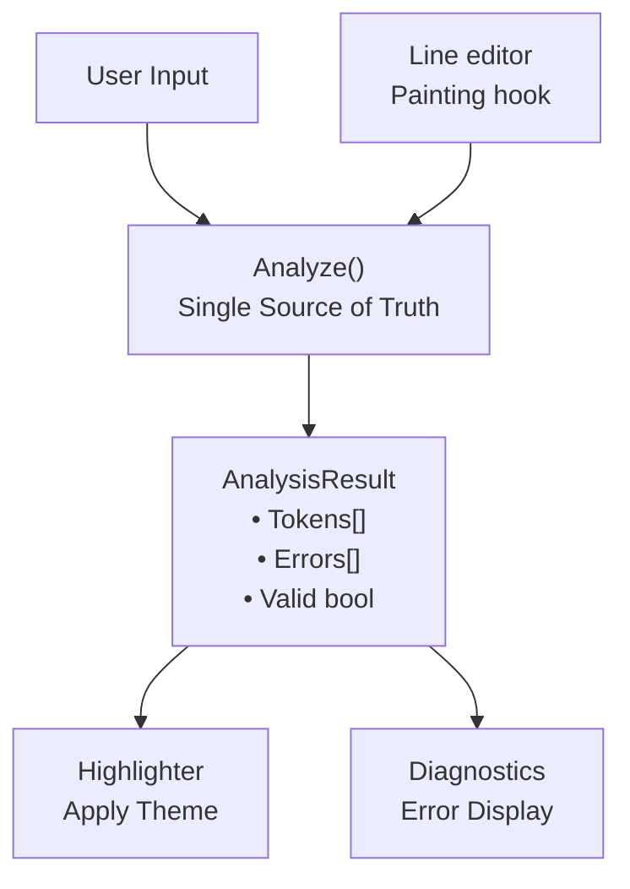

# Foundation Shell Syntax Highlighting Specification

> **Canonical for:** the syntax analyzer, semantic token types, the theme system, and REPL highlighting. The authority map lives in the README.

---

## Table of Contents

1. [Overview](#1-overview)
2. [Architecture](#2-architecture)
3. [Semantic Token Types](#3-semantic-token-types)
4. [Analyzer Behavior](#4-analyzer-behavior)
5. [Theme System](#5-theme-system)
6. [REPL Integration](#6-repl-integration)
7. [Error Highlighting](#7-error-highlighting)
8. [Diagnostics Formatting](#8-diagnostics-formatting)
9. [Depth Tracking](#9-depth-tracking)
10. [Edge Cases](#10-edge-cases)
11. [Future Enhancements](#11-future-enhancements)

---

## 1. Overview

Foundation Shell provides real-time syntax highlighting for interactive shell input. The highlighting system is designed around three core principles:

1. **Single Source of Truth**: `Analyze()` powers both syntax highlighting AND syntax validation, and it tokenizes nothing itself — it classifies what the one scanner returns (quoting.md §1.3). What the user sees highlighted and what the shell will actually run come from the same pass over the input.

2. **Semantic Token Types**: Highlighting is based on semantic meaning, not colors. Token types (e.g., `TypeCommand`, `TypeOperator`) are decoupled from visual presentation, allowing themes to customize appearance.

3. **Real-Time Feedback**: highlighting updates on every keystroke, through the line editor's painting hook (§6.1). The user gets immediate visual feedback, with invalid syntax marked as it is typed.

### System Components



---

## 2. Architecture

### 2.1 Core Types

#### SemanticType

An enumerated type representing the semantic meaning of a token:

```
TypeUnknown
TypeCommand
TypeArgument
TypeOperator
TypeRedirection
TypeRedirectionTarget
TypeSingleQuotedString
TypeDoubleQuotedString
TypeBacktick
TypeCommandSubst
TypeVariable
TypeParenGroup
TypeError
TypeWhitespace
```

`TypeUnknown` is the zero value. A token MUST never carry it once analysis finishes. The name `TypeCommandSubst` is deliberate, because `$(...)` is command substitution. "Subshell" is reserved for the future `( ... )` grouping construct.

#### AnalyzedToken

A token with semantic information and position data:

| Field | Meaning |
|-------|---------|
| `Type` | The semantic meaning (§3) |
| `Value` | The raw text of the token |
| `Start` | Character position, counted from 0, inclusive |
| `End` | Character position, exclusive |
| `Depth` | The maximum nesting level reached in this token, over quotes and command substitutions (§9.4) |

#### SyntaxError

A syntax error with position and message:

| Field | Meaning |
|-------|---------|
| `Start` | Start position, counted from 0 |
| `End` | End position, exclusive |
| `Message` | The human-readable error description (diagnostics.md §5) |

#### AnalysisResult

The complete result of syntax analysis:

| Field | Meaning |
|-------|---------|
| `Tokens` | The analyzed tokens, in input order |
| `Errors` | The syntax errors, innermost first (§9.2) |
| `Valid` | True exactly when `Errors` is empty |

### 2.2 Key Interfaces

#### Theme

A theme is a total map from every semantic type of §2.1 to one ANSI escape string.

#### Highlighter

Applies syntax highlighting using a theme:

A highlighter holds one theme and offers two operations over an input string:

| Operation | Yields |
|-----------|--------|
| Highlight | The input with the theme's escapes applied |
| Highlight with result | The same string, plus the syntax errors the analysis found |

---

## 3. Semantic Token Types

Each token type represents a specific semantic meaning in shell syntax. Token types are color-agnostic. The theme decides the visual presentation.

### 3.1 TypeCommand

**Definition:** The first word in a command position.

**Trigger Conditions:**
- First word of input
- First word after pipe (`|`)
- First word after `&&`
- First word after `||`
- First word after `;`

**Examples:**
```sh
echo hello          # "echo" is TypeCommand
cat file | grep x   # "cat" and "grep" are both TypeCommand
cmd1 && cmd2        # "cmd1" and "cmd2" are both TypeCommand
```

**NOT TypeCommand:**
```sh
echo hello          # "hello" is TypeArgument (not first)
cmd > file          # "file" is TypeRedirectionTarget (after redirection)
```

### 3.2 TypeArgument

**Definition:** A word that is an argument to a command.

**Trigger Conditions:**
- Any word after the first word in command position
- NOT immediately after a redirection operator

**Examples:**
```sh
echo hello world    # "hello" and "world" are TypeArgument
ls -la /tmp         # "-la" and "/tmp" are TypeArgument
```

### 3.3 TypeOperator

**Definition:** Control flow and pipeline operators.

**Recognized Operators:**
| Operator | Length | Description |
|----------|--------|-------------|
| `\|`     | 1      | Pipe |
| `;`      | 1      | Command separator |
| `&&`     | 2      | Logical AND |
| `\|\|`   | 2      | Logical OR |

**State Change:** After an operator (except `;` at end), the next word is TypeCommand.

**Examples:**
```sh
cmd1 | cmd2         # "|" is TypeOperator
cmd1 && cmd2        # "&&" is TypeOperator
cmd1 ; cmd2         # ";" is TypeOperator
```

### 3.4 TypeRedirection

**Definition:** File redirection operators.

**Recognized Operators:**
| Operator | Length | Description |
|----------|--------|-------------|
| `>`      | 1      | Redirect stdout (overwrite) |
| `<`      | 1      | Redirect stdin |
| `>>`     | 2      | Redirect stdout (append) |
| `2>`     | 2      | Redirect stderr (overwrite) |
| `2>>`    | 3      | Redirect stderr (append) |

**Matching Order:** Longer operators MUST be matched before shorter ones (e.g., `2>>` before `>>` before `>`).

**State Change:** After a redirection operator, the next word is TypeRedirectionTarget.

### 3.5 TypeRedirectionTarget

**Definition:** The filename following a redirection operator.

**Trigger Conditions:**
- The word immediately following any TypeRedirection token

**Examples:**
```sh
echo > output.txt   # "output.txt" is TypeRedirectionTarget
cmd 2>> errors.log  # "errors.log" is TypeRedirectionTarget
cat < input.txt     # "input.txt" is TypeRedirectionTarget
```

### 3.6 TypeSingleQuotedString

**Definition:** Content enclosed in single quotes.

**Recognition Rules:**
- Starts with `'` and ends with `'`
- The entire token (including quotes) must form a complete quoted string
- Single quotes do NOT interpret escape sequences
- Single quotes do NOT expand variables

**Depth Tracking:** Single quotes use the open/nest/close depth rule (§9.2, canonical in quoting.md §5.2). A region still open at end of input is an unclosed-quote error — possible even with an even quote count.

**Examples:**
```sh
echo 'hello world'        # "'hello world'" is TypeSingleQuotedString
echo 'it 'really' works'  # One token; the nested pair stays literal (depth 1->2->1->0)
echo 'hello               # TypeError (region still open at end of input)
```

### 3.7 TypeDoubleQuotedString

**Definition:** Content enclosed in double quotes.

**Recognition Rules:**
- Starts with `"` and ends with `"`
- The entire token (including quotes) must form a complete quoted string
- Escape sequences ARE processed (e.g., `\"`, `\\`)
- Variables ARE expanded within double quotes (but the whole token is still TypeDoubleQuotedString)

**Depth Tracking:** Double quotes use the same open/nest/close depth rule (§9.2).

**Escape Handling:**
- `\"` does NOT count toward quote depth
- `\\` is a literal backslash

**Examples:**
```sh
echo "hello world"           # "\"hello world\"" is TypeDoubleQuotedString
echo "echo \"word\""         # Valid (escaped inner quotes never touch depth)
echo "outer "inner" outer"   # Valid nesting (depth 1->2->1->0); nested pair stays literal
echo "hello                  # TypeError (region still open at end of input)
```

### 3.8 TypeBacktick

**Definition:** Command substitution using backticks.

**Recognition Rules:**
- Starts with `` ` `` and ends with `` ` ``
- Content between backticks is executed as a command
- The result replaces the backtick expression

**Depth Tracking:** Backticks use the same open/nest/close depth rule (§9.2). Nested backticks execute recursively (quoting.md §6.3).

**Context Rules:**
- Backticks are NOT recognized inside single quotes
- Backticks ARE recognized inside double quotes

**Examples:**
```sh
echo `date`              # "`date`" is TypeBacktick
echo `echo `nested``     # Valid nesting (depth 1->2->1->0); runs nested, then echo <output>
echo `unclosed           # TypeError (region still open at end of input)
```

### 3.9 TypeCommandSubst

**Definition:** Command substitution using `$(...)` syntax.

**Recognition Rules:**
- Starts with `$(`
- Ends with matching `)`
- Parentheses must be balanced
- A `)` inside the body's open quotes does not close the substitution (lexer.md §7.1)

**Depth Tracking:** Tracks parenthesis depth to handle nested substitutions.

**Context Rules:**
- Command substitutions are NOT recognized inside single quotes
- Command substitutions ARE recognized inside double quotes

**Examples:**
```sh
echo $(date)                 # "$(date)" is TypeCommandSubst
echo $(date +%Y-%m-%d)       # "$(date +%Y-%m-%d)" is TypeCommandSubst
echo $(echo $(pwd))          # Nested substitution (valid)
echo $(unclosed              # TypeError (unbalanced parens)
```

### 3.10 TypeVariable

**Definition:** Variable references.

**Recognition Rules:**
- A `$` starts a variable token ONLY when a letter (a-z, A-Z), an underscore, `{`, or `?` follows it. The forms are `$VAR`, `$_var`, `${HOME}`, and the special parameter `$?` (expansion.md §Special Parameters)
- `$(` starts a command substitution instead (§3.9)
- Any other `$` (followed by a digit, punctuation, whitespace, or end of input) is a literal character within the word — `$1`, `$-foo`, and a trailing `$` are NOT variables

**Context Rules:**
- Variables are NOT expanded inside single quotes
- Variables ARE expanded inside double quotes
- When inside double quotes, the entire quoted string is TypeDoubleQuotedString, not TypeVariable

**Examples:**
```sh
echo $HOME               # "$HOME" is TypeVariable
echo ${HOME}             # "${HOME}" is TypeVariable
echo $PATH/bin           # "$PATH/bin" is TypeVariable (entire token)
echo '$HOME'             # "'$HOME'" is TypeSingleQuotedString (not variable)
echo $?                  # "$?" is TypeVariable (special parameter)
echo $1                  # "$1" is TypeArgument ($ + digit cannot start a name)
```

### 3.11 TypeParenGroup

**Definition:** Bare parentheses outside a `$(...)` command substitution.

**Recognition Rules:**
- Single `(` or `)` character not belonging to a `$(...)` substitution
- Reserved for command grouping, which is a FUTURE feature (operators.md). Such input does not execute today

**Examples:**
```sh
(echo hello)             # "(" and ")" are TypeParenGroup
```

### 3.12 TypeError

**Definition:** Invalid or error regions in the input.

**Trigger Conditions:**
- Unclosed single quote
- Unclosed double quote
- Unclosed backtick
- Unclosed command substitution `$(...)`

**Highlighting:** Error tokens are still highlighted (with error styling) to show the user exactly what is problematic.

**Examples:**
```sh
echo "unclosed           # "\"unclosed" is TypeError
echo 'missing            # "'missing" is TypeError
echo $(open              # "$(open" is TypeError
```

### 3.13 TypeWhitespace

**Definition:** Spaces and tabs between tokens.

**Recognition Rules:**
- One or more consecutive whitespace characters (space, tab, etc.)
- Whitespace is tokenized to enable accurate position tracking

**Examples:**
```sh
echo hello               # Single space " " is TypeWhitespace
echo    hello            # Multiple spaces "   " is TypeWhitespace
```

### 3.14 TypeUnknown

**Definition:** Default/fallback type for unclassified tokens.

**Usage:** this type must not appear in practice. Its presence indicates a gap in the analyzer.

---

## 4. Analyzer Behavior

### 4.1 The Analysis Operation

Analysis takes the input string and yields one analysis result (§2.1).

`Analyze` does NOT tokenize. `Scan` does (quoting.md §1.3), and `Analyze` is one of its two views: it calls `Scan` once and then

1. classifies each token semantically, from the structural role the scanner already assigned
2. carries through the positions and nesting depths the scanner recorded
3. reports every unterminated construct the scanner found
4. renders the problems `Validate` reports, which is the same rule set the parser rejects on.

That division is the point. Highlighting cannot disagree with execution about what a token is, because it is not deciding.

### 4.2 State Machine

The analyzer holds NO scanning state. Quote depths, the substitution stack, the position cursor and the command/redirection-target bookkeeping all live in the scanner, which resolves them before `Analyze` sees a token. What arrives is a flat slice in which every rune of the input is accounted for.

### 4.3 Analysis Flow

1. **Scan once.** `Scan(input)` returns the tokens and the list of unterminated constructs.

2. **Locate the unclosed word.** An unterminated construct swallows the rest of the input. Only the LAST word can carry one. That word is typed `TypeError`.

3. **Classify each token** (§4.5). Whitespace, comments and operators map directly. A word's type comes from its scanner-assigned role and its written form.

4. **Report.** Every unterminated construct becomes an error at the word's span, innermost first (§9.2). The structural problems follow. They come from the same rule set the parser rejects on, rendered with this surface's wording (diagnostics.md §5.1).

### 4.4 Operator Matching

Operator recognition belongs to the scanner (lexer.md §3.3), which matches longest-first: `2>>`, then `&&` `||` `>>` `2>`, then `|` `;` `>` `<`. `2>` and `2>>` apply only when the pending word is exactly an unquoted, unescaped `2`, so `echo a2>f` tokenizes as `a2`, `>`, `f`.

Two characters are NOT operators and must not be highlighted as such. A single `&` lexes as a word, and a word that is exactly `&` is reported as an error (§7.2). Parentheses are ordinary word characters — `TypeParenGroup` is reserved for the subshell grouping operators.md lists as future work, and nothing produces it today.

### 4.5 Word Type Determination

After parsing a word, its type is determined by:

1. **Error Check:** If any quote/substitution depth is unbalanced, return TypeError
2. **Redirection Target:** If `afterRedirection` is true, return TypeRedirectionTarget
3. **Quoted String:** If the ENTIRE word is wrapped in one matching quote pair, return the appropriate string type. A word that mixes quote styles or has unquoted parts (e.g. `'a'"b"`) is NOT a string type and falls through
4. **Command Substitution:** If the word matches the `$(...)` pattern, return TypeCommandSubst
5. **Variable:** If the word starts with `$` followed by a letter, underscore, or `{` (§3.10), return TypeVariable
6. **Command vs Argument:** the scanner's role decides. `RoleCommand` gives TypeCommand, and every other role gives TypeArgument. The analyzer does not re-derive which word starts a command. The parser reads that same role to build the chain.

---

## 5. Theme System

### 5.1 Theme Definition

A theme maps each semantic type to one ANSI escape string. Every type of §2.1 MUST have an entry.

### 5.2 Default Theme

The default theme provides sensible colors for terminal display:

| SemanticType | ANSI Code | Color | Description |
|--------------|-----------|-------|-------------|
| TypeCommand | `\033[1;36m` | Bold Cyan | Commands stand out |
| TypeArgument | `\033[0m` | Default | Arguments blend in |
| TypeOperator | `\033[1;33m` | Bold Yellow | Operators are prominent |
| TypeRedirection | `\033[35m` | Magenta | Redirections are distinct |
| TypeRedirectionTarget | `\033[0m` | Default | Targets blend in |
| TypeSingleQuotedString | `\033[32m` | Green | Single quotes |
| TypeDoubleQuotedString | `\033[33m` | Yellow | Double quotes (different) |
| TypeBacktick | `\033[36m` | Cyan | Command substitution |
| TypeCommandSubst | `\033[36m` | Cyan | Command substitution |
| TypeVariable | `\033[34m` | Blue | Variables |
| TypeParenGroup | `\033[35m` | Magenta | Grouping |
| TypeError | `\033[4;31m` | Underline Red | Errors are very visible |
| TypeWhitespace | `\033[0m` | Reset | Invisible |
| TypeUnknown | `\033[0m` | Reset | Fallback |

### 5.3 ANSI Escape Code Format

ANSI codes follow the format: `\033[<params>m`

Common parameters:
- `0` - Reset all attributes
- `1` - Bold
- `4` - Underline
- `30-37` - Foreground colors (black, red, green, yellow, blue, magenta, cyan, white)
- `38;5;N` - 256-color foreground
- `40-47` - Background colors
- `48;5;N` - 256-color background

### 5.4 Theme Customization

Create a custom theme by providing a Theme map:

```
custom theme:
    TypeCommand   -> "\033[38;5;196m"   # Bright red
    TypeArgument  -> "\033[38;5;226m"   # Yellow
    TypeOperator  -> "\033[38;5;21m"    # Blue
    ...
```

**Partial Themes:** the highlighter falls back to the ANSI reset (`\033[0m`) for a semantic type the theme leaves undefined.

### 5.5 Highlighting Application

The highlighter applies colors as follows:

```
APPLY_THEME(tokens) -> string
    output = empty
    for each token in tokens:
        color = the theme's escape for token.Type
        if the theme has no entry: color = ANSI_RESET
        append color, then token.Value, then ANSI_RESET
    return output
```

**Key Behavior:** Each token is followed by an ANSI reset to prevent color bleeding.

---

## 6. REPL Integration

### 6.1 The Painter Contract

The interactive line editor MUST offer a painting hook. The hook takes the line as written, plus the cursor position, and returns the text to display:

```
PAINT(line, cursor_position) -> display_text
    return HIGHLIGHT(line)      # §5.5, with the active theme
```

The cursor position is available to the hook. The default painter ignores it. Highlighting depends on the line alone.

### 6.2 Editor Configuration

The editor is configured with the default theme (§5.2) and the shell's own streams. Its prompt comes from execution.md §Prompt System.

### 6.3 Real-Time Highlighting

The editor calls the painting hook on every keystroke. This gives:
- Immediate visual feedback
- Real-time error highlighting
- Consistent highlighting as the user types

### 6.4 Performance Considerations

The analyzer is designed to be fast enough for real-time use:
- Single-pass analysis
- No backtracking
- O(n) time complexity where n is input length
- Minimal allocations

---

## 7. Error Highlighting

### 7.1 Unified Analysis

The same `Analyze()` function is used for BOTH:
1. Syntax highlighting (via Highlighter)
2. Syntax validation (via AnalysisResult.Errors)

This ensures that any syntax error visible in highlighting is also reported as a diagnostic error, and vice versa.

The promise extends across components. Analysis and execution MUST accept exactly the same inputs. An input the analysis marks valid must tokenize without error. An input it rejects must fail tokenization.

This now holds by construction rather than by agreement. Both are views of a single scan (quoting.md §1.3). The tokens come from one pass, and the structural rules from one validation. No second scanner exists to drift. The conformance suite MUST still cross-check the promise. For every corpus input, tokenization fails if and only if the analysis result is invalid. The two views still differ in what they DO with a scan. A projection can lose a token. A renderer can mislabel one.

### 7.2 Error Detection

The analyzer detects these error conditions (canonical strings: diagnostics.md §5):

| Error | Detection | Message |
|-------|-----------|---------|
| Unclosed single quote | `singleQuoteDepth > 0` | `unclosed single quote` |
| Unclosed double quote | `doubleQuoteDepth > 0` | `unclosed double quote` |
| Unclosed backtick | `backtickDepth > 0` | `unclosed backtick` |
| Unclosed command substitution | `parenDepth > 0` | `unclosed command substitution $(...)` |
| Leading operator | First non-whitespace token is a chain operator | `unexpected operator at start: <op>` |
| Trailing operator | Last non-whitespace token is `\|`, `&&`, or `\|\|` | `unexpected operator at end` |
| Missing redirect target | Last non-whitespace token is a redirection | `missing redirection target` |
| Background operator | A word token is exactly `&` (not a redirection target) | `background execution is not supported` |
| Here-document | A `<` token is followed by a `<` token | `here-documents are not supported` |

The leading- and trailing-token checks look at the last/first NON-WHITESPACE token — trailing blanks do not defeat them.

### 7.3 Error Token Marking

When an error is detected within a word:
1. The token is assigned `TypeError` semantic type
2. A `SyntaxError` is added to the result
3. The error token is still included in the token stream (for highlighting)

### 7.4 Error Position Tracking

Each error carries the position fields of §2.1: an inclusive `Start`, an exclusive `End`, and the canonical `Message`.

### 7.5 Highlighting Errors

Tokens with `TypeError` type are highlighted using the theme's error color:
- Default: `\033[4;31m` (underline red)
- Provides clear visual indication of the error region
- Helps users identify exactly what needs to be fixed

---

## 8. Diagnostics Formatting

### 8.1 The Formatting Operation

Diagnostic formatting takes the input string and the syntax errors, and yields the text to print. That text carries:
1. The original input line
2. A caret line (`^^^^^`) pointing to the error
3. The error message

### 8.2 Output Format

```
echo "unclosed
     ^^^^^^^^^
error: unclosed double quote
```

### 8.3 Caret Line Construction

The caret line is built from the error's start and end positions:

- Leading spaces align carets with the error position
- Carets (`^`) span from `start` to `end`
- Minimum of 1 caret even for zero-length errors

### 8.4 Multi-Error Handling

Multiple errors are displayed sequentially, with a blank line between blocks (diagnostics.md §7). Both messages use the canonical strings. One unclosed construct usually swallows the rest of the line. A `'` inside open double quotes is literal. It cannot make a second error. Two errors need two independently unclosed constructs. One example is an unclosed substitution that contains an unclosed quote:

```
echo $(foo "bar
     ^^^^^^^^^^
error: unclosed double quote

echo $(foo "bar
     ^^^^^^^^^^
error: unclosed command substitution $(...)
```

### 8.5 Edge Case Handling

The diagnostics system handles:
- Empty input
- Errors at start of input (position 0)
- Errors at end of input
- Errors beyond input bounds (graceful clamping)
- Zero-length errors (minimum 1 caret)
- Negative positions (graceful handling)
- Reversed positions (Start > End)
- Unicode characters
- Tab characters
- Special characters in strings

---

## 9. Depth Tracking

### 9.1 Purpose

Depth tracking implements Foundation Shell's flagship non-POSIX feature: whitespace-delimited quote NESTING (quoting.md §5.2, §6). The depth on each token comes from the scanner. The scanner applies the open/nest/close rule once, for execution and analysis alike. The canonical statement is quoting.md §5. In a traditional shell a same-type quote character always closes. Here it can open an interior region instead. The depth counters track exactly that.

### 9.2 Depth Counting Rules

For each quote type (single, double, backtick) the analyzer keeps an open-region depth counter (quoting.md §5.1) driven by the rule (quoting.md §5.2):

- **Depth 0:** an active, unescaped quote character always OPENS its region (depth → 1).
- **Depth ≥ 1:** a same-type quote character NESTS one level (depth+1) under two conditions. The previous rune is whitespace, AND a next rune exists that is neither whitespace nor any quote character (`'`, `"`, `` ` ``). Otherwise it CLOSES one level (depth−1).
- Valid input has every counter at 0 at end of input. A positive counter is an unclosed region, reported with the canonical string (diagnostics.md §5).
- Validity is a DEPTH check, not a parity check: an even quote count can be unclosed (`echo 'a 'b` nests and ends at depth 2), and an odd count always is.

For command substitutions:

- `$(` increments the substitution depth. A `)` with no open quote region in the body decrements it. These are explicit delimiters. The neighbor rule is not involved.
- Backticks follow the quote rule above. A positive backtick depth at end of input is an unclosed backtick.
- Positive `$(` depth at end of input is an unclosed command substitution.

### 9.3 Context Rules

Which characters are ACTIVE (tracked) in which context — matching quoting.md §5.3:

| Context | Single Quotes | Double Quotes | Backticks | Command Subst `$(...)` |
|---------|---------------|---------------|-----------|------------------------|
| Top-level | Rule (§9.2) | Rule (§9.2) | Rule (§9.2) | Tracked |
| Inside `'...'` | Same-type rule (nest/close) | Literal | Literal | Literal |
| Inside `"..."` | Literal | Same-type rule (nest/close) | Rule (opens substitution) | Tracked |
| Inside `` `...` `` body | Literal | Tracked (body state; never gates the body's closing) | Same-type rule (nest/close) | Tracked (opens nested context) |
| Inside `$(...)` body | Tracked (body state; gates `)`) | Tracked (body state; gates `)`) | Rule (opens nested context) | Tracked (nested) |

Substitution bodies begin a fresh quote context. The enclosing depths are saved at the body boundary. They are restored there too. The body's characters stay verbatim. Execution re-parses the body recursively (quoting.md §5.3, lexer.md §7.1).

### 9.4 AnalyzedToken.Depth Field

`Depth` is defined PRECISELY as **the maximum nesting level reached within the token, across quote regions and command substitutions**. It is the high-water mark of the combined total depth (quoting.md §5.4) over the token's span.

```
# Keep a running total nesting level:
#   +1 on every region open or nest (a quote OPEN or NEST, a $( , a
#      backtick open or nest)
#   -1 on every close
# Record the per-token high-water mark:
token_depth = MAX(token_depth, current_total_depth)
```

| Token | Depth |
|-------|-------|
| `foo` (unquoted) | 0 |
| `'a'` | 1 |
| `'a 'b' c'` | 2 |
| `"x $(date)"` | 2 |
| `$(echo $(pwd))` | 2 |

It is a per-token maximum, NOT the final counter value. This enables future depth-based visualization (§11.1).

### 9.5 Examples

**Nested Single Quotes:**
```sh
echo 'it 'really' works'
     ^1  ^2      ^1     ^0    # OPEN, NEST (space before, r after), CLOSE, CLOSE
# One token; argument: it 'really' works
```

**Nested Double Quotes:**
```sh
echo "outer "inner" outer"
     ^1     ^2     ^1     ^0    # OPEN, NEST, CLOSE, CLOSE
# One token; argument: outer "inner" outer
```

**Nested Command Substitutions:**
```sh
echo $(echo $(pwd))
     ^1     ^2   ^1^0    # explicit delimiters
```

**Nested Backticks (recursive execution — quoting.md §6.3):**
```sh
echo `outer `inner` end`
     ^1     ^2     ^1   ^0
# `inner` runs inside the outer substitution's body when it is re-parsed
```

---

## 10. Edge Cases

### 10.1 Empty Input

- Analysis returns empty token slice
- No errors
- `Valid = true`

### 10.2 Whitespace-Only Input

- Single TypeWhitespace token
- No errors
- `Valid = true`

### 10.3 Escaped Characters

Outside single quotes, backslash escapes the next character:
- `\"` - Literal double quote (not quote depth change)
- `\'` - Literal single quote (not quote depth change)
- `` \` `` - Literal backtick (not backtick depth change)
- `\\` - Literal backslash
- `\$` - Literal dollar sign (not variable)

Inside single quotes, NO escape processing occurs.

### 10.4 Trailing Semicolon

A trailing `;` is VALID (like bash):
```sh
echo hello ;   # Valid, no error
```

Other trailing operators are INVALID:
```sh
echo hello |   # Error: unexpected operator at end
echo hello &&  # Error: unexpected operator at end
echo hello ||  # Error: unexpected operator at end
```

### 10.5 Variable in Path

A variable followed by path characters is a single token:
```sh
cd $HOME/projects    # "$HOME/projects" is TypeVariable (single token)
```

### 10.6 Adjacent Quotes

Adjacent quoted segments form ONE word token (a quote character is not a word boundary — §4.3):
```sh
echo 'a'"b"    # One token: "'a'\"b\"" - TypeArgument
```

The whole-word type rules apply (§4.5): `'a'"b"` mixes quote styles, so it is TypeArgument, not a string type. The execution lexer concatenates the same word into the single token `ab` (lexer.md §4.4).

### 10.7 Redirection Without Space

Redirection operators can be adjacent to arguments:
```sh
echo>file      # "echo" (Command), ">" (Redirection), "file" (RedirectionTarget)
```

The execution lexer tokenizes this identically (lexer.md §3.3) — `echo>file` is valid end-to-end.

### 10.8 Multiple Redirections

Multiple redirections in one command are each tokenized:
```sh
cmd < in > out 2>> err
```
Tokens: `cmd`, `<`, `in`, `>`, `out`, `2>>`, `err`

---

## 11. Future Enhancements

### 11.1 Depth Tracking Visualization

The `Depth` field in `AnalyzedToken` — the per-token maximum nesting level (§9.4) — is designed for future visual features:

- **Nested Highlighting:** Different shades or styles based on nesting level
- **Rainbow Quotes/Brackets:** Different colors for each nesting level (nested quote pairs, `$(...)` levels)
- **Depth Indicators:** Visual markers showing nesting level

### 11.2 Potential Token Type Extensions

Future versions may add:
- `TypeBuiltin` - Shell built-in commands
- `TypeAlias` - User-defined aliases
- `TypeFunction` - Shell function names
- `TypeGlob` - Glob patterns (`*.txt`, `**/*.md`)
- `TypeBraceExpansion` - Brace expansions (`{a,b,c}`)
- `TypeArithmetic` - Arithmetic expressions (`$((1+2))`)
- `TypeConditional` - Conditional expressions (`[[ ... ]]`)

### 11.3 LSP Integration

The semantic token system is designed to be compatible with Language Server Protocol (LSP) semantic tokens, enabling:
- IDE integration
- Remote highlighting
- Cross-editor consistency

### 11.4 Configurable Error Behavior

Future enhancements may include:
- Warning vs error distinction
- Configurable strictness levels
- Custom error messages
- Error recovery suggestions

---

## Appendix A: ANSI Escape Code Reference

### Basic Colors (Foreground)
| Code | Color |
|------|-------|
| 30 | Black |
| 31 | Red |
| 32 | Green |
| 33 | Yellow |
| 34 | Blue |
| 35 | Magenta |
| 36 | Cyan |
| 37 | White |

### Bright Colors (Foreground)
| Code | Color |
|------|-------|
| 90 | Bright Black (Gray) |
| 91 | Bright Red |
| 92 | Bright Green |
| 93 | Bright Yellow |
| 94 | Bright Blue |
| 95 | Bright Magenta |
| 96 | Bright Cyan |
| 97 | Bright White |

### Attributes
| Code | Attribute |
|------|-----------|
| 0 | Reset |
| 1 | Bold |
| 2 | Dim |
| 3 | Italic |
| 4 | Underline |
| 7 | Reverse |
| 9 | Strikethrough |

### 256-Color Mode
- Foreground: `38;5;N` where N is 0-255
- Background: `48;5;N` where N is 0-255

---

## Appendix B: Required Conformance Coverage

A conformance suite MUST cover each behavior below.

### Analysis
- Basic command parsing
- Token position accuracy
- All operator types
- Single and double quotes
- Nested quotes (whitespace-delimited nesting, quoting.md §5.2/§6 — incl. multi-level)
- Unclosed quote errors (incl. even-count unclosed inputs like `'a 'b`)
- Variables (simple and braced)
- Command substitutions (`$(...)`)
- Backticks
- Nested backticks (recursive execution, quoting.md §6.3)
- Trailing operator errors
- Missing redirection target errors
- Escaped characters
- Error position accuracy
- Depth values (§9.4 per-token maximum: `foo` 0, `'a'` 1, `'a 'b' c'` 2)
- Empty input
- Whitespace-only input
- Command after pipe
- Command after semicolon
- Lexer/analyzer validity cross-check (§7.1)

### Highlighting
- Basic command highlighting
- All operator highlighting
- Redirection highlighting
- Quote highlighting (single/double)
- Variable highlighting
- Command substitution highlighting
- Backtick highlighting
- Error highlighting (unclosed constructs)
- Input preservation (stripped ANSI equals original)
- Custom theme application
- Partial theme handling
- Complex pipeline highlighting
- Chained operator highlighting
- Multiple redirections
- Empty input
- Whitespace handling
- ANSI reset after each token

### Diagnostics
- Single error formatting
- Multiple error formatting
- Caret alignment
- Empty errors
- Nil errors
- Error at start
- Error at end
- Single character errors
- Long error spans
- Edge cases (negative positions, reversed positions, etc.)
- Unicode handling
- Real-world integration tests

---

*End of Specification*
